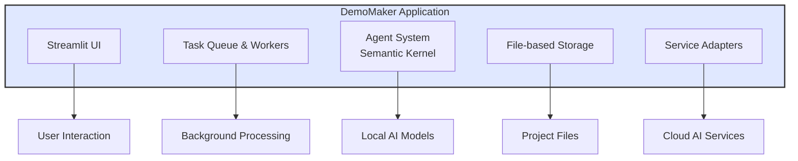
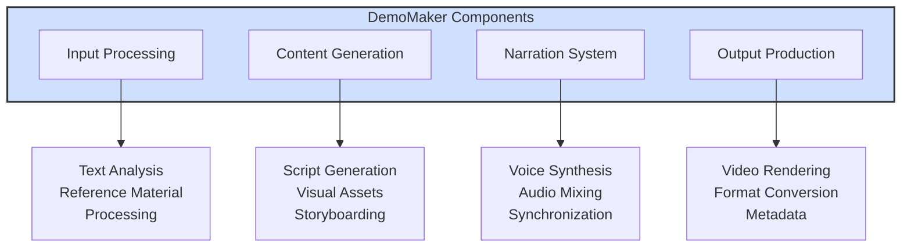
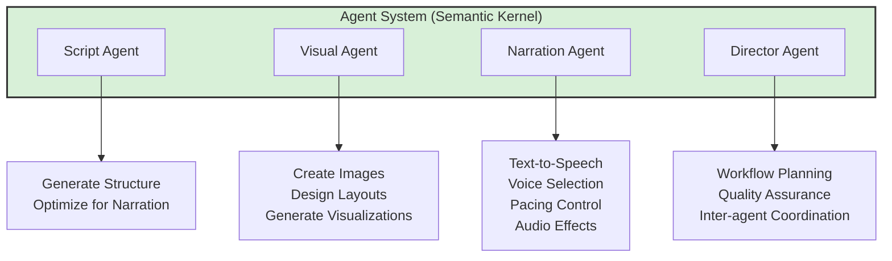
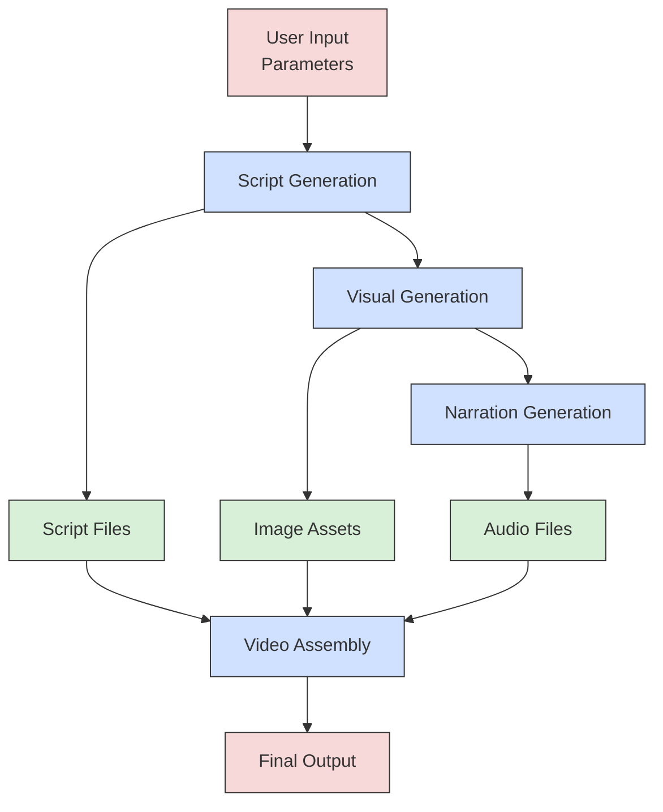
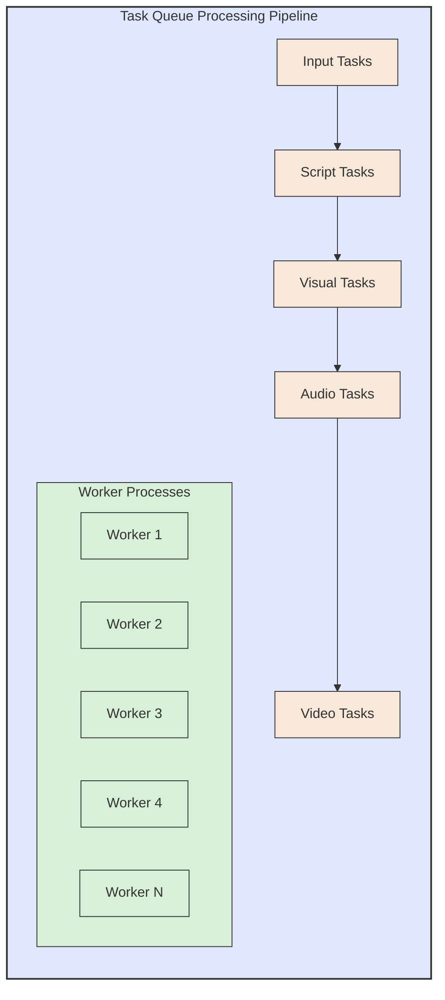
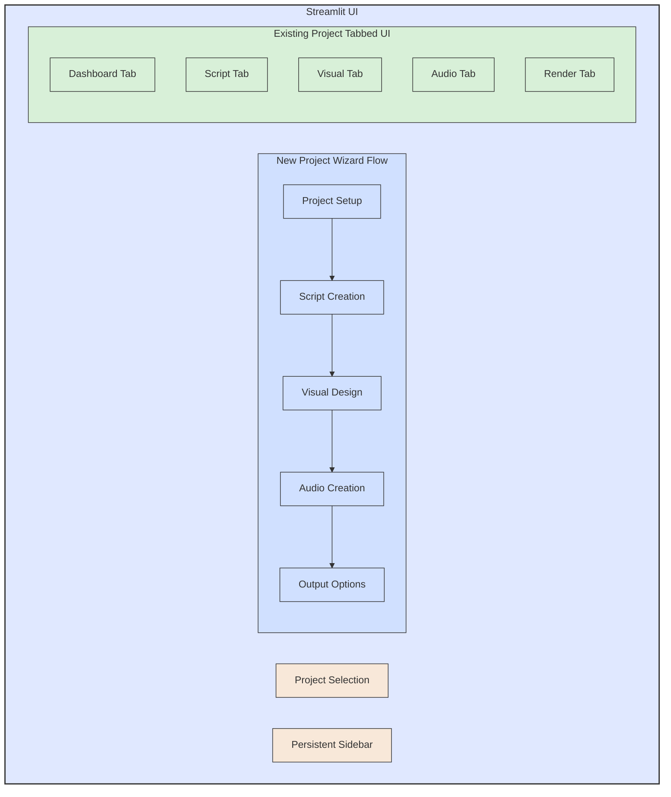
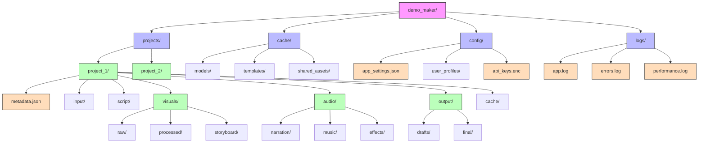

# 15. Mermaid Architecture Diagrams

Date: April 21, 2025

## Status

Accepted

## Context

While the ASCII art diagrams in ADR #13 provide a basic visualization of the architecture, they have limitations in terms of clarity, maintainability, and aesthetics. Mermaid diagrams offer a more professional, maintainable, and readable alternative that can be rendered in many markdown viewers and documentation systems.

## Decision

We will supplement our architecture documentation with Mermaid diagrams that correspond to the ASCII diagrams created in ADR #13. These diagrams will help stakeholders better understand the system architecture.

### 1. High-Level System Architecture

### 2. Component Architecture

### 3. Agent System Architecture

### 4. Data Flow Diagram

### 5. Processing Pipeline

### 6. UI Architecture

### 7. File Storage Structure

